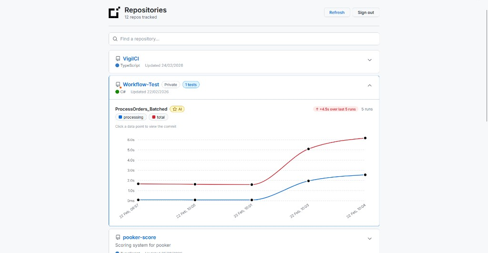
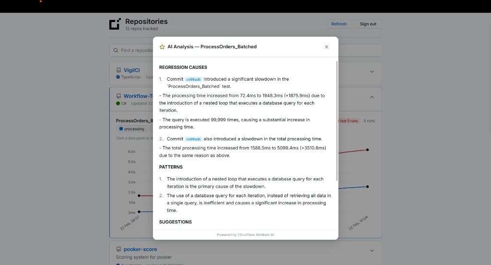

# VigilCI

Track test performance trends directly in CI. VigilCI is a performance testing framework for .NET built on xUnit v3 that measures execution times across multiple runs, computes statistics, and automatically publishes results to a GitHub Gist for trend tracking.

## Features

- **Zero-config framework** — just add the NuGet package and use `[PerformanceTest]`
- **Multi-run averaging** — run tests N times and get min/avg/max timing per segment
- **Segment timing** — measure specific code sections with `PerfTimer.Measure("name")`
- **Auto gist publishing** — results are pushed to a GitHub Gist after all tests complete
- **Auto gist creation** — no need to create a gist manually; one is created on first run
- **[Dashboard](https://dansmith-dev.github.io/VigilCI/)** — a web app to visualize performance trends over time





## Quick Start

### Prerequisites

- A **.NET 8.0+** test project using **xUnit v3**
- A **GitHub repository** with your project pushed (VigilCI reads the git remote to associate results with your repo)
- A **GitHub Personal Access Token** with the **`gist`** scope — [create one here](https://github.com/settings/tokens)

### 1. Install the package

```bash
dotnet add package VigilCI.Core
```

### 2. Set your GitHub token

VigilCI needs a token to publish results to a gist. Set it as an environment variable before running tests:

```bash
# PowerShell
$env:VIGILCI_GITHUB_TOKEN = "ghp_your_token_here"

# Bash
export VIGILCI_GITHUB_TOKEN=ghp_your_token_here
```

### 3. Write a performance test

```csharp
using VigilCI.Core;

public class MyTests
{
    [PerformanceTest(runs: 5)]
    public void DatabaseQuery_ShouldBeUnder50ms()
    {
        using (PerfTimer.Measure("query"))
        {
            var result = db.ExecuteQuery("SELECT * FROM users");
        }

        using (PerfTimer.Measure("serialization"))
        {
            var json = JsonSerializer.Serialize(result);
        }
    }
}
```

### 4. Run your tests

```bash
dotnet test
```

VigilCI runs the test 5 times, measures each segment, computes averages, and publishes the results to a GitHub Gist. It automatically finds your existing gist (by looking for one containing `vigilci-results.json`), or creates a new private gist on the first run. Subsequent runs append to the same gist — no extra configuration needed.

See [CI Integration](#ci-integration) for setting this up in GitHub Actions.

### 5. View trends in the dashboard

Open the [VigilCI Dashboard](https://dansmith-dev.github.io/VigilCI/), sign in with GitHub, and your repositories with VigilCI results will appear automatically.

## How It Works

### The `[PerformanceTest]` Attribute

Extends xUnit's `[Fact]` attribute with a `runs` parameter. Each test method decorated with `[PerformanceTest(runs: N)]` will be executed N times as a single test result.

```csharp
[PerformanceTest]          // runs once, still collects timing
[PerformanceTest(runs: 10)] // runs 10 times, averages the results
```

### Measuring Segments with `PerfTimer`

Wrap any code block in a `using (PerfTimer.Measure("name"))` to time it:

```csharp
[PerformanceTest(runs: 5)]
public async Task ApiCall()
{
    using (PerfTimer.Measure("http-request"))
    {
        await httpClient.GetAsync("/api/data");
    }

    using (PerfTimer.Measure("parsing"))
    {
        ParseResponse(response);
    }
}
```

After all runs complete, VigilCI groups segments by name and computes:

| Segment | Avg (ms) | Min (ms) | Max (ms) | Runs |
|---------|----------|----------|----------|------|
| http-request | 45.2 | 41.0 | 52.3 | 5 |
| parsing | 3.1 | 2.8 | 3.5 | 5 |
| total | 48.3 | 44.1 | 55.8 | 5 |

A `total` segment is automatically added for the overall test duration.

### Multi-Run Execution

When `runs > 1`, the test method is executed multiple times but appears as a **single test** in your test runner. Only the first run reports pass/fail to xUnit — subsequent runs use a silent message bus to avoid duplicate results. If any run fails, execution stops immediately.

## CI Integration

VigilCI automatically publishes results to a GitHub Gist when the right environment variables are set. In local development (no env vars), nothing happens — tests run normally with no side effects.

### Environment Variables

| Variable | Required | Description |
|----------|----------|-------------|
| `VIGILCI_GITHUB_TOKEN` | Yes | A GitHub Personal Access Token (PAT) with the **`gist`** scope. Used to authenticate with the GitHub API for creating and updating gists. |
| `VIGILCI_GIST_ID` | No | Explicit gist ID to skip the automatic lookup. If omitted, VigilCI searches your gists for one containing `vigilci-results.json` and uses it. If none exists, a new private gist is created. |

Only `VIGILCI_GITHUB_TOKEN` is needed. If it's not set, publishing is skipped entirely and tests behave like normal xUnit tests.

### Step-by-Step Setup

#### 1. Create a GitHub Personal Access Token

1. Go to [github.com/settings/tokens](https://github.com/settings/tokens)
2. Click **Generate new token** (classic) or **Generate new token (fine-grained)**
3. For a **classic** token: check the **`gist`** scope only
4. For a **fine-grained** token: under **Account permissions**, set **Gists** to **Read and write**
5. Click **Generate token** and copy it — you won't be able to see it again

#### 2. Add secrets to your GitHub repository

1. Navigate to your repository on GitHub
2. Go to **Settings** > **Secrets and variables** > **Actions**
3. Click **New repository secret**
4. Add a secret with:
   - **Name:** `VIGILCI_GITHUB_TOKEN`
   - **Value:** the token you just created
5. Click **Add secret**

#### 3. Add the GitHub Actions workflow

Create a file at `.github/workflows/perf-tests.yml` in your repository:

```yaml
name: Performance Tests

on:
  push:
    branches: [main]
  pull_request:
    branches: [main]

jobs:
  perf-tests:
    runs-on: ubuntu-latest

    steps:
      - uses: actions/checkout@v4

      - name: Setup .NET
        uses: actions/setup-dotnet@v4
        with:
          dotnet-version: '8.0.x'

      - name: Run performance tests
        env:
          VIGILCI_GITHUB_TOKEN: ${{ secrets.VIGILCI_GITHUB_TOKEN }}
        run: dotnet test
```

The `env` block passes your token as an environment variable to the `dotnet test` process. VigilCI picks it up automatically — no code changes needed.

#### 4. Push and run

Push a commit or open a pull request to trigger the workflow. VigilCI will automatically find or create a gist and publish results. Every subsequent run appends to the same gist. The dashboard can then read this gist to display performance trends over time.

### Local Development

You can also test publishing locally by setting the environment variables in your shell:

```bash
# PowerShell
$env:VIGILCI_GITHUB_TOKEN = "ghp_your_token_here"
dotnet test

# Bash
VIGILCI_GITHUB_TOKEN=ghp_your_token_here dotnet test
```

Without these variables set, VigilCI does nothing beyond running your tests normally.

## Architecture

```
┌─────────────────────────────────────────────────────┐
│                    Test Assembly                      │
│                                                       │
│  [PerformanceTest(runs: 5)]                          │
│  public void MyTest()                                │
│  {                                                    │
│      using (PerfTimer.Measure("work")) { ... }       │
│  }                                                    │
└──────────────────────┬──────────────────────────────┘
                       │
          ┌────────────▼────────────┐
          │  PerformanceTestCase    │
          │  (ISelfExecutingXunit   │
          │   TestCase)             │
          │                         │
          │  Runs test N times,     │
          │  collects timing via    │
          │  PerformanceContext     │
          └────────────┬────────────┘
                       │
          ┌────────────▼────────────┐
          │  PerformanceResultStore │
          │  (ConcurrentBag)        │
          │                         │
          │  Accumulates results    │
          │  from all tests         │
          └────────────┬────────────┘
                       │
          ┌────────────▼────────────┐
          │  VigilCiExecutor        │
          │  (XunitTestFramework    │
          │   Executor)             │
          │                         │
          │  After ALL tests done:  │
          │  → GistPublisher        │
          └────────────┬────────────┘
                       │
          ┌────────────▼────────────┐
          │  GitHub Gist API        │
          │                         │
          │  Creates or updates     │
          │  vigilci-results.json   │
          └─────────────────────────┘
```

### Key Components

| File | Role |
|------|------|
| `PerformanceTestAttribute` | Extends `[Fact]` with a `runs` parameter, points to custom discoverer |
| `PerformanceTestDiscoverer` | Creates `PerformanceTestCase` instances during test discovery |
| `PerformanceTestCase` | Implements `ISelfExecutingXunitTestCase` — runs the test N times with timing |
| `PerfTimer` | Public API for measuring code segments inside test methods |
| `PerformanceContext` | Internal `AsyncLocal` storage for timing data across async operations |
| `TestTimingContext` | Collects `TimingSegment` data per run, computes averages |
| `PerformanceResultStore` | Thread-safe accumulator for results from all test cases |
| `VigilCiTestFramework` | Custom xUnit framework that wraps the executor |
| `VigilCiExecutor` | Overrides `RunTestCases` to publish results after all tests complete |
| `GistPublisher` | HTTP client for GitHub Gist API (create, fetch, patch) |

### Zero-Touch NuGet Registration

The NuGet package includes a `buildTransitive/VigilCI.Core.targets` file that auto-generates an assembly attribute at build time:

```csharp
[assembly: Xunit.TestFramework(typeof(VigilCI.Core.VigilCiTestFramework))]
```

This means consumers never need to write any setup code — just reference the package and use `[PerformanceTest]`.

## Dashboard

The [VigilCI Dashboard](https://dansmith-dev.github.io/VigilCI/) is a web app that reads your gist and visualizes performance trends over time. Sign in with GitHub to connect it to your gist data.

The source for the dashboard lives in the `dashboard/` directory of this repository.

## License

MIT
